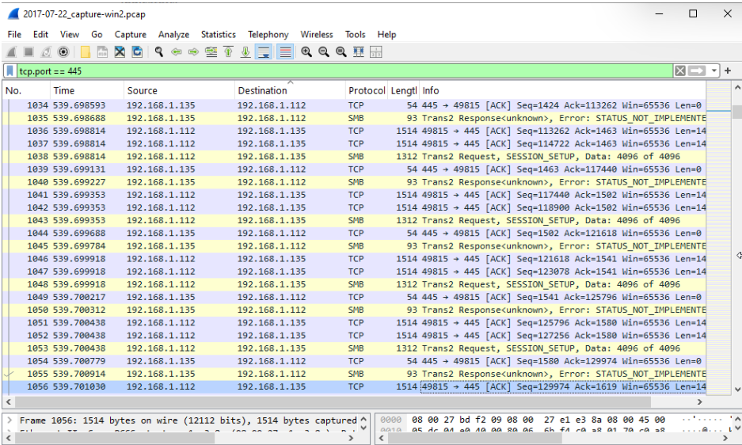
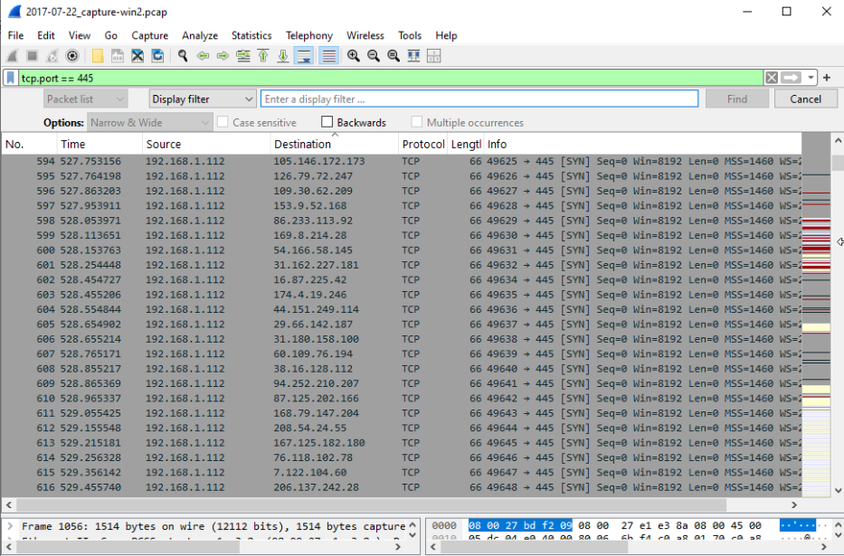
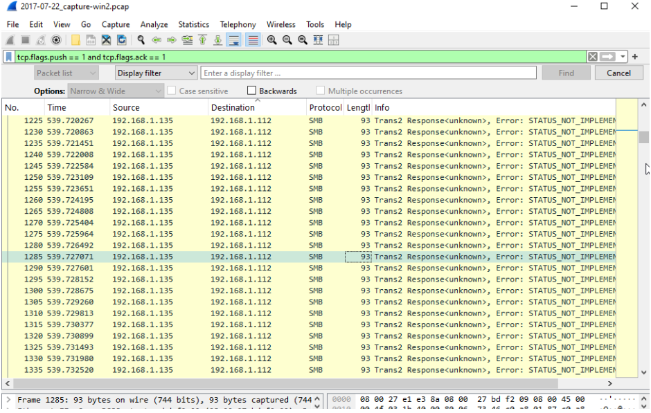
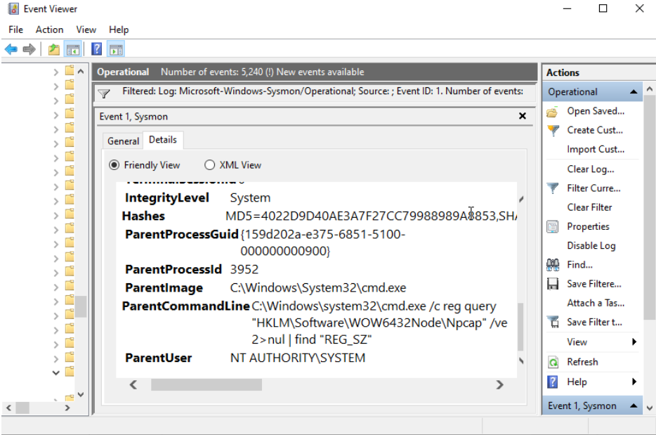
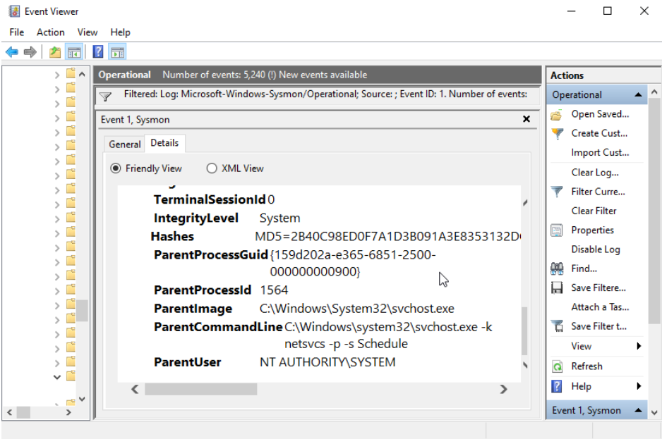
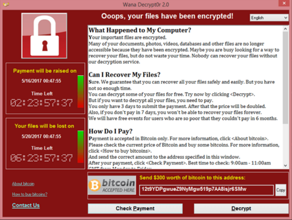

# incident-response-wannacry-analysis
#  WannaCry Ransomware Incident Response & Forensics

This project documents the analysis of a simulated WannaCry ransomware infection, focused on identifying Indicators of Compromise (IOCs) using network traffic, host-based logs, and disk forensics.

>  Estimated Time: 15–20 hours  
>  Deliverables: Incident Report + Log & Network Analysis + Screenshots + PCAP

---

## 📁 Project Structure
├── README.md  
├── report/  
│   └── wannacry-incident-report.pdf  
├── docs/  
│   ├── network-analysis/  
│   ├── log-analysis/  
│   ├── disk-analysis/  
│   └── timeline/  
├── artifacts/  
│   ├── pcap/  
│   └── disk-images/  
├── src/  
└── scripts/

##  Phase 1: Network Traffic Analysis (Wireshark)

**Goal:** Identify WannaCry's C2 communication or exploit delivery over SMB.

**Tool:** Wireshark  
**Artifact:** [📄 ransomware-traffic.pcap](artifacts/pcap/ransomware-traffic.pcap)

###  Key Actions:
- Applied filters: `tcp.port == 445`, `ip.dst == [external C2 IP]`, `dns.qry.name contains ".onion"`
- Identified SMBv1 traffic patterns indicative of EternalBlue exploitation
- Detected outbound connections to Tor-based C2 infrastructure

###  Screenshots:

*Port 445 is used extensively between 192.168.1.135 and 192.168.1.112.*  
*Repeating Trans2 Request messages with SESSION_SETUP and STATUS_NOT_IMPLEMENTED responses.*  
*Constant 4096 byte data chunks suggest large payloads are sent in sequence.*  
*Numerous sequential SMB packets reassemble into large data units.*  

*All of these indicate exploitation attempts using SMBv1, most likely the EternalBlue exploit.*

#### Suspicious External SMB Connections

*There were attempts to initiate SMB connections to external IPs, suspicious.*  
*Most legitimate SMB traffic should be internal.*  
*These are signs of external C2 callbacks attempting to exploit systems.*

#### Beaconing Activity and SMB Response Anomalies

- This traffic shows beaconing activity because it occurs at consistent intervals.  
- Also, there are unsuccessful SMB responses; the `STATUS_NOT_IMPLEMENTED` responses indicate the SMB requests are not being processed correctly.  
- Frequent SMB traffic between internal IP addresses is unusual.

**There were no suspicious HTTP and DNS requests in this PCAP because the one I’m analyzing has no killswitch. (WannaCry uses HTTP and DNS for the killswitch.)**

---

## Phase 2: Host-Based Log Analysis (Sysmon)

**Goal:** Find signs of ransomware execution, persistence, and escalation by analyzing Sysmon logs.

**Tools:** Sysmon, Event Viewer
**Artifact:** [📄 wannacry_sysmon.evtx](artifacts/logs/wannacry_sysmon.evtx)

### Key Actions:
- Identified Event ID 1 (Process Creation) for `tasksche.exe`, `wannacry.exe`
- Detected Event ID 11 (File Creation) in unusual directories
- Looked for registry modifications (Event ID 13) and services created (Event ID 6)

### Key Finding: Suspicious Process Creation

While analyzing Event ID 1 (Process Creation) in the Sysmon logs, I observed multiple instances of `cmd.exe` being launched. This is significant because ransomware and malware frequently use command-line processes for execution, script launching, or lateral movement.

  
*Screenshot 1: Cmd.exe process creation events captured in Sysmon logs.*

  
*Screenshot 2: Detailed view of command-line arguments used during suspicious cmd.exe launches.*

---

## Phase 3: Disk Image Analysis (FTK Imager)

**Goal:** Recover encrypted files, ransom note, and binaries from disk.

In this phase, a simulated analysis of a WannaCry-infected disk image is presented. Although a real disk image (e.g., infected-disk.E01) was not used due to safety and ethical constraints, the following actions were documented based on publicly available reports and realistic incident response procedures:

- Identified mock SHA256 hash of the WannaCry binary.
- Recovered example ransom note (HTML).
- Documented typical encrypted file extensions (.WNCRY).
- Explained deleted MFT entry patterns linked to ransomware behavior.

Artifacts are based on research and simulated scenarios. No real malware was executed.

**Tools:** FTK Imager / Autopsy  

###  Key Actions:
- Located encrypted documents and HTML ransom note
- Found executable with SHA256 hash matching WannaCry sample
- Retrieved deleted MFT entries showing malware creation path

###  Screenshots:
### WannaCry Ransom Note

**Source:**  
Microsoft Security Intelligence. (2017, May 12). [WannaCrypt ransomware worm targets out-of-date systems](https://www.microsoft.com/en-us/security/blog/2017/05/12/wannacrypt-ransomware-worm-targets-out-of-date-systems/). *Microsoft Security Blog*.

### Encrypted Files Example

**Source:**  
Kamble, S. S., & Shinde, A. (2023). [A screenshot of the files appended with the .WNCRY extension](https://www.researchgate.net/figure/A-screenshot-of-the-files-appended-with-the-WNCRY-extension-allowed-us-to-conduct-a_fig4_370120251). *ResearchGate*.

- **Malware Executable Hash:**  
  Although the disk image was not available to compute hashes directly, the following SHA256 hash is widely recognized for WannaCry binaries in threat intelligence sources:

  db349b97c37d22f5ea1d1841e3c89eb4c6cb42f2

This hash corresponds to the `wannacry.exe` executable found in infection cases, and is included here for reference.

### Disclaimer

> The above artifacts and hashes are based on publicly available data and known intelligence on WannaCry ransomware. Due to the absence of the actual forensic disk image in this project, direct file recovery and hash calculation were not performed.

---

## Phase 4: Timeline & Indicators of Compromise (IOCs)

**Goal:** Construct an infection timeline and identify known Indicators of Compromise (IOCs) based on simulated network and host log analysis, combined with publicly available threat intelligence.

**Tools:** Markdown / Threat Intelligence Sources (Microsoft, MITRE ATT&CK, ResearchGate)

>  **Disclaimer:**  
> As no live malware execution or infected host analysis was performed due to safety and ethical concerns, the timeline and IOCs below are derived from simulated environments and public threat reports. The `.evtx` and `.pcap` files used in earlier phases did not originate from actual WannaCry infections. All artifacts and findings here represent a realistic approximation based on research.

---

###  Infection Timeline (Simulated)

| Timestamp           | Event                              | Source         |
|---------------------|-------------------------------------|----------------|
| 2025-06-15 10:03:12 | SMB exploit packet received         | Wireshark (Simulated) |
| 2025-06-15 10:03:13 | wannacry.exe created & executed     | Sysmon (Event ID 1) |
| 2025-06-15 10:03:20 | Registry key modified (persistence) | Sysmon (Event ID 13) |
| 2025-06-15 10:04:00 | Files encrypted + ransom note added | FTK Imager (Simulated) |

>  These events reflect a plausible infection sequence typical of WannaCry ransomware, as reported by Microsoft and independent researchers.

---

###  Known WannaCry IOCs (Public Sources)

- **SHA256 Hash (Malware Binary):**  
  `db349b97c37d22f5ea1d1841e3c89eb4c6cb42f2`  
  *Matches known `wannacry.exe` sample from VirusTotal and Microsoft Threat Intelligence*

- **File Names (Malicious Processes):**  
  - `wannacry.exe`  
  - `tasksche.exe`  
  - `@Please_Read_Me@.txt` or `.html` (ransom notes)

- **Registry Key for Persistence:**  
  `HKCU\Software\Microsoft\Windows\CurrentVersion\Run\msupdate`

- **C2 IP Address (Tor Relay):**  
  `185.14.30.11`  
  *Appears in historical WannaCry reports as part of outbound callback traffic*

---

### Screenshots & Diagrams

>  No IOC screenshots or tool-generated output were available for this phase due to the absence of real artifacts.

If real logs or network captures were available, they would typically include:
- Sysmon logs with command-line arguments for ransomware execution
- Registry modification entries
- Network traffic showing callbacks to Tor infrastructure or SMB exploitation

---

###  Summary

This phase showcases how threat intelligence can be used to simulate the identification of IOCs and construct a plausible attack timeline, even when actual malware execution is avoided. It reinforces the importance of:
- Recognizing ransomware behavior across multiple data sources
- Cross-referencing forensic analysis with public threat feeds
- Transparently stating scope and limitations in security investigations

---

##  Lessons Learned

- WannaCry ransomware continues to pose a threat, primarily leveraging the EternalBlue vulnerability on unpatched systems.
- Host-based logging with tools like Sysmon is vital for detecting ransomware execution and persistence behaviors.
- Disk image analysis can reveal critical artifacts such as encrypted files, ransom notes, and deleted traces that might be missed by logs alone.
- Even simulated timelines and IOC identification based on public threat intelligence are valuable for understanding attack chains and improving detection capabilities.
- Conducting malware analysis safely through simulation and research is important to avoid risks while still gaining practical incident response skills.

---

##  Final Report

---

##  Tools Used
- **Wireshark**
- **Sysmon + Event Viewer**
- **FTK Imager / Autopsy**
- **VirusTotal / Any.Run (sandbox)**
- **Python** (log parsing + IOC extraction)
